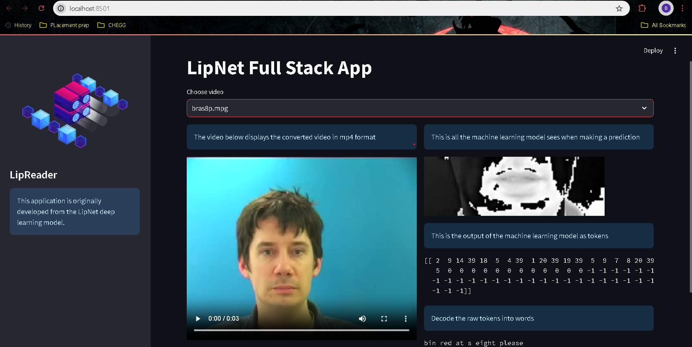

# LipReader - LipNet Full Stack Application

LipReader is a full-stack application developed from the LipNet deep learning model. This application converts video files to MP4 format, displays the video and  and demonstrates the lip-reading capabilities of the LipNet model.



## Features

- Convert video files to MP4 format
- Display the original and converted videos
- Display the machine learning model's input (video frames as an animation)
- Display the model's output as tokens and decoded text

## Installation

Follow these steps to set up the project locally:

### Prerequisites

- Python 3.8 or later
- pip (Python package installer)
- ffmpeg (for video conversion)

### Steps

1. **Clone the repository:**

    ```bash
    git clone https://github.com/BhuvaneshKhangar/LipReader.git
    cd LipReader
    ```

2. **Set up a virtual environment:**

    ```bash
    python -m venv myenv
    source myenv/bin/activate   # On Windows use `myenv\Scripts\activate`
    ```

3. **Install required Python packages:**

    ```bash
    pip install -r requirements.txt
    ```

4. **Install ffmpeg:**
    - Download ffmpeg from [ffmpeg.org](https://ffmpeg.org/download.html).
    - Extract the files and add the `bin` directory to your system's PATH.

## Usage

1. **Run the Streamlit application:**

    ```bash
    streamlit run app/streamlitapp.py
    ```

2. **Interact with the application:**
    - Select a video from the dropdown menu.
    - View the converted video and the model's input and output.

## Project Structure

- `app/streamlitapp.py`: The main Streamlit application script.
- `data/s1/`: Directory containing sample videos.
- `img1.png`: Sidebar image for the Streamlit application.
- `modelutil.py`: Utility functions for loading the model.
- `utils.py`: Utility functions for loading data and converting tokens to characters.

## Troubleshooting

### Video Conversion Failed

If you encounter the error `'ffmpeg' is not recognized as an internal or external command`, ensure that ffmpeg is installed and added to your system's PATH.

### TensorFlow Version Issues

If you have issues with TensorFlow versions, ensure you have the correct version specified in `requirements.txt` and installed via `pip`.

## Contributing

Contributions are welcome! Please open an issue or submit a pull request.

## License

This project is licensed under the MIT License. See the `LICENSE` file for details.

## Acknowledgements

- The original LipNet model developers.
